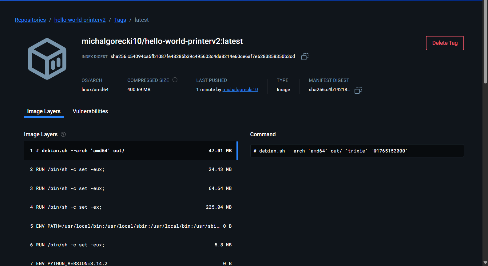
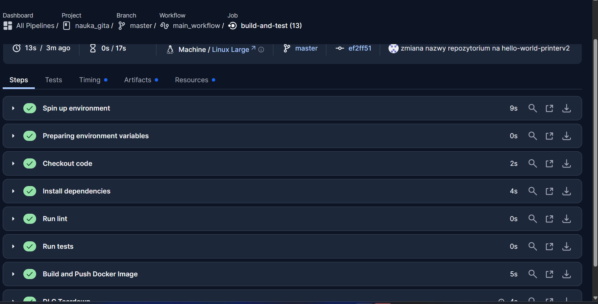
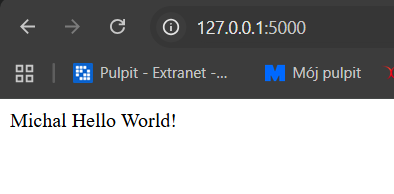

# Simple Flask App - Nauka CI/CD

Projekt dydaktyczny realizowany w celu nauki procesów Continuous Integration, Continuous Delivery oraz Continuous Deployment. Aplikacja oparta na frameworku Flask, wyświetlająca komunikaty w różnych formatach.

## Wykonane Zadania

### 1. Konfiguracja Środowiska Lokalnego
- Utworzono hermetyczne środowisko wirtualne (`venv`).
- Zainstalowano niezbędne zależności z plików `requirements.txt` oraz `test_requirements.txt`.
- Skonfigurowano plik `Makefile` jako "Single Point of Entry" dla kluczowych zadań (instalacja, testy, lint).

### 2. Poprawa Jakości Kodu (Linting)
- Wdrożono narzędzie `flake8` do sprawdzania zgodności kodu ze standardem **PEP8**.
- Naprawiono błędy stylistyczne:
    - Dodano odpowiednią liczbę pustych linii w pliku `views.py`.
    - Użyto komentarza `# noqa`, aby uciszyć zamierzone błędy importu w `__init__.py`.
    - Zapewniono obecność pustej linii na końcu plików (zgodnie z błędem `W292`).

### 3. Automatyzacja z CircleCI (Continuous Integration)
- Utworzono folder `.circleci` i plik konfiguracyjny `config.yml`.
- Skonfigurowano rurociąg (pipeline), który automatycznie przy każdym wypchnięciu kodu (`git push`):
    - Pobiera kod (`checkout`).
    - Instaluje zależności (`make deps`).
    - Sprawdza styl kodu (`make lint`).
    - Uruchamia testy jednostkowe (`make test`).
- Przeprowadzono symulację awarii i naprawy procesu budowania (Fail/Success).

### 4. Konteneryzacja (Docker)
- Przygotowano instrukcję budowania obrazu w pliku `Dockerfile`.
- Rozszerzono `Makefile` o zadania:
    - `docker_build`: Budowanie obrazu aplikacji.
    - `docker_run`: Uruchamianie aplikacji w izolowanym kontenerze.
- Przetestowano lokalnie działanie aplikacji w kontenerze na porcie `5000`.
- Zintegrowano budowanie Dockera z CircleCI na maszynie `ubuntu-2204:2024.01.2`.

### 5. Continuous Delivery (Docker Hub)
- Obraz został poprawnie otagowany i wysłany do publicznego rejestru **Docker Hub**.
- Link do obrazu: [https://hub.docker.com/r/michalgorecki10/hello-world-printerv2](https://hub.docker.com/r/michalgorecki10/hello-world-printerv2)


---

## Dokumentacja Wizualna

### Potwierdzenie publikacji w Docker Hub


### Workflow "build-and-test" na CircleCI:


### Działająca aplikacja
Zrzut ekranu przedstawiający aplikację działającą w przeglądarce pod adresem `http://127.0.0.1:5000`, pobraną z Docker Hub.




---

## Instrukcja Uruchomienia

### Środowisko lokalne:
```bash
# Instalacja
make deps
# Testy
make test
# Uruchomienie
python main.py